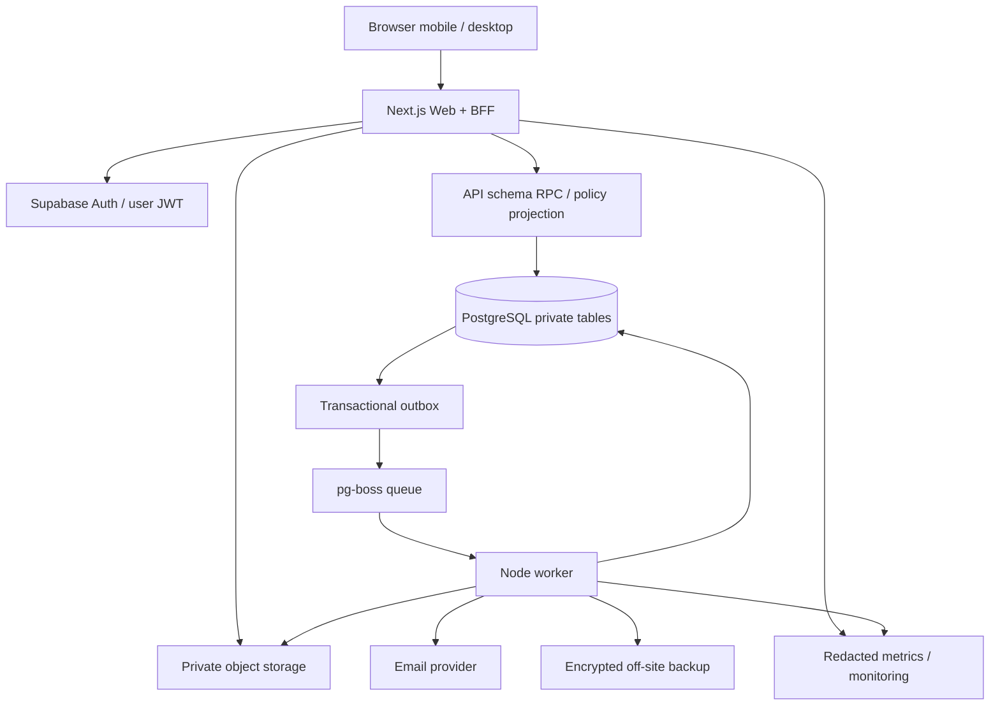

# 15. Kiến trúc và công nghệ

## Quyết định chính

Next.js App Router + TypeScript strict cho website/BFF; Supabase PostgreSQL/Auth/Storage; worker Node.js + pg-boss; Tailwind 4 + shadcn/Radix cho UI đã tùy biến; React Flow + ELK cho cây; Vitest/Playwright/axe cho test. Dùng React Hook Form + Zod cho form/validation, TanStack Query ở màn hình dữ liệu tương tác; không thêm global store cho mọi server state.

Node 24 LTS và nhánh Next 16.3 stable là baseline nghiên cứu; patch và peer versions phải pin tại P0. [S04][S05] Việc lựa chọn này là khuyến nghị kiến trúc cho yêu cầu agent-driven, không phải khẳng định stack này vượt mọi lựa chọn khác.

## Vì sao không dùng nguyên webtrees/Gramps Web

Các nền tảng đó là nguồn tham khảo rất tốt về domain/quyền/cây/export. [S01][S02] Dự án cần giao diện Việt hóa trang nghiêm riêng, lịch giỗ có quy ước của họ, sổ quỹ/khuyến học và quy trình duyệt đặc thù. Vì vậy xây ứng dụng riêng nhưng giữ chuẩn trao đổi và tránh tự viết auth/storage/queue. Không copy code GPL vào sản phẩm mà chưa đánh giá license; học mô hình nghiệp vụ không đồng nghĩa được chép giao diện/code/assets tùy ý.

## Luồng tổng thể



Browser Supabase client chỉ phục vụ flow auth được hỗ trợ và upload intent đã hạn chế. Web đọc dữ liệu qua user-scoped RPC; không credential quản trị trong client. Route public có projection riêng; route thành viên không static generate/ISR.

## Ranh giới module

```
apps/web       Next app, UI, route handlers, server auth adapters
apps/worker    job handlers, scheduler, media, import/export, outbox dispatcher
packages/domain      pure genealogy/date/permission/finance rules + tests
packages/contracts   typed DTO, Zod schemas, OpenAPI generation
packages/database    SQL migrations, RPC inventory, generated DB types
packages/ui          tokens + shared components + stories
packages/lunar       LunarCalendarAdapter + golden tests, no React
packages/config      lint/tsconfig/env schema
supabase             local config + migrations/tests mapped to database package
scripts              doctor, verify, seed, release, backup/restore checks
```

Chọn **một** nơi canonical cho migrations (`supabase/migrations`), package database chỉ export type/helper và liên kết, không giữ bản SQL thứ hai lệch nhau. Domain TS dùng cho preview và unit tests; DB constraint/transaction bảo đảm integrity khi bỏ qua UI. Từng rule quan trọng có test đối chiếu hai lớp.

## Web runtime

Server Components cho phần đọc initial và public content. Client Components chỉ cho cây, form, search, tương tác. Graph/media viewer load động theo route. `proxy.ts` dùng đúng pattern Next 16; không coi proxy là lớp authorization duy nhất. Error boundary và loading tại segment, không toàn bộ app spinner. Server Actions nếu dùng phải qua cùng domain/authz; HTTP contracts vẫn cần cho tác vụ BFF rõ ràng.

Không bật experimental/canary để có hiệu ứng đẹp. Không cache authenticated fetch bằng global singleton chứa user token. Public content cache chỉ cho projection không chứa dữ liệu nhạy cảm; bất kỳ Set-Cookie response nào no-store. [S04][S07]

## Database và connections

Web gọi Data API/RPC, không mở hàng trăm DB connections. Migrations dùng direct/session connection tương thích mạng của môi trường, không transaction pool khi công cụ cần session semantics. Worker pg-boss dùng connection riêng, pool nhỏ dự kiến 2–5, session/direct được spike; runtime không có DDL permission. Job schema do migration/deploy role tạo và nâng phiên bản trước release.

Outbox ghi cùng transaction nghiệp vụ; dispatcher publish vào queue với dedupe key. Không ghi DB rồi gọi email trực tiếp trong request. Job side effects là at-least-once trên thực tế: phải idempotent dù queue cung cấp cơ chế chống nhận trùng. [S14]

## Media và file processing

Supabase private buckets: quarantine, originals, derivatives, exports. Không bucket public cho tư liệu gia phả mặc định. Worker dùng Sharp để re-encode ảnh/strip EXIF, kiểm tra MIME và malware scanner trong môi trường production; scan lỗi thì pending/blocked, không “cho qua”. PDF viewer sandbox không chạy script/active content. Book PDF do Chromium render template nội bộ đã escape, không mở arbitrary URL của người dùng.

Local scanner có thể mô phỏng chỉ ở test; production cần engine/provider thật được duyệt. Video không tự transcoding lớn ở bản 1; nhận file giới hạn và phát native theo MIME được hỗ trợ, không tuyên bố chạy mọi codec.

## Triển khai tham chiếu

Railway: web container, worker container, service scan nếu tự host; Supabase: prod project và staging project độc lập; Resend: email ứng dụng và SMTP auth cấu hình riêng; Cloudflare DNS, R2 off-site backup encrypted. Người sở hữu account là chủ dự án. Vùng gần Việt Nam ưu tiên nơi cả nhà cung cấp hỗ trợ sau H2; không mặc định dữ liệu đặt Việt Nam. Nếu yêu cầu lưu trữ nội địa, dừng provisioning và lập ADR self-host/nhà cung cấp phù hợp.

Không bắt buộc Kubernetes, Redis hoặc Elasticsearch với mục tiêu ban đầu. Nếu cần đổi hosting, giữ container artifact và S3-compatible backup/export để giảm phụ thuộc; Supabase Auth/Storage vẫn cần kế hoạch di chuyển cụ thể, không gọi hệ thống hoàn toàn vendor-neutral.

## MCP và công cụ agent

Không bắt buộc MCP để bắt đầu. Đọc tài liệu chính thức/SOURCES trước, Context7 chỉ là hỗ trợ nếu đã có. Công cụ browser/Playwright dùng với demo/staging. Git, test, DB local đủ làm phần lớn công việc. Không cấp MCP production quyền write hoặc vault secrets không giới hạn; approval gates vẫn áp dụng với mọi công cụ.
